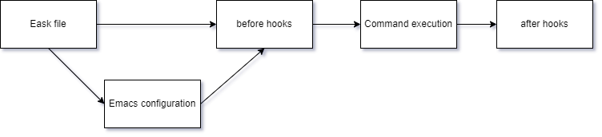

Eask consists of two components: a command-line tool (the Eask CLI),
and Elisp scripts.

The CLI, is used to find the corresponding lisp file and feed it into the
Emacs executable. It would parse all options and convert them to Emacs
understandable options on the lisp scripts end. It is written in plain
JavaScript, the main file is located in **src/util.js**.

The Elisp scripts, is used to do the actual execution for each command that passes
through the CLI. All commands are split into its file and are organized in the
**lisp** folder. It is written in plain Emacs Lisp, the main file is located in
**lisp/_prepare.el**.



## 🖥️ CLI & Yargs

The yargs command file is written in JavaScript, and located under the **cmds**
folder. Each file under, will be named with convention `[command_name].js`. This
file should define basic command-line parsing rules and correctly prepare data
to feed the Emacs session.

Let's look at the file `cmds/core/archives.js`:

```js
exports.command = ['archives', 'sources'];  // alias to sources
exports.desc = 'List out all package archives';

exports.handler = async (argv) => {
  await UTIL.e_call(argv, 'core/archives');
};
```

This is a standard yargs command file, which contains all the information we
need to pass it to the Emacs session.

* **exports.command** is the argument pattern, but it also accepts alias (array)
* **exports.desc** is the command description
* **exports.handler** is an asynchronous function that handles command execution
* **UTIL** is a global variable that points to the `src/util.js` module.
* **`'core/archives'`** is the elisp file under **lisp** folder (without `.el` extension).

`eask` is a JavaScript file that holds all our global options.

```js
yargs
  .usage('Usage: eask <command> [options..]')
  .help(
    'help',
    'Show usage instructions.'
  )
  .options({
    'global': {
      description: `change default workspace to ~/.eask/`,
      alias: 'g',
      type: 'boolean',
    },
  })

...
```

For **local** options, please use `exports.builder` and specify under its
command file.

See
[yargs/docs/advanced.md](https://github.com/yargs/yargs/blob/main/docs/advanced.md),
the official documentation for more information and getting a better explanation
would help!

## 📜 Elisp Script

Elisp scripts are located under the **lisp** folder and will wait to get called
by the CLI. All Elisp scripts are written in Emacs Lisp and should have a
similar structure below:

```elisp
(let ((dir (file-name-directory (nth 1 (member "-scriptload" command-line-args)))))
  (load (expand-file-name "_prepare.el"
                          (locate-dominating-file dir "_prepare.el"))
        nil t))

(eask-start
  (message "PWD is %s" default-directory))
```

See [Development API](https://emacs-eask.github.io/Development-API/) section for
more information!

## 📂 Project Structure

There are **three** places you need to look into it:

1. `eask` file at the root of the project
2. `cmds` folder with all available commands
3. `lisp` folder with all elisp code

`eask` is the node entry, and the main yargs definition! `cmds` and `lisp`
folders are command files that correspond to each other.

### ♻️ Execution Order for Eask

Eask is executed this way:



* **Eask environment** builds sandbox and reads Eask file information
* **Emacs configuration** is only being executed when `-g` option is enabled
* **before hooks** are hooks run before command task
* **command execution** is the primary command task
* **after hooks** are hooks run after command task
