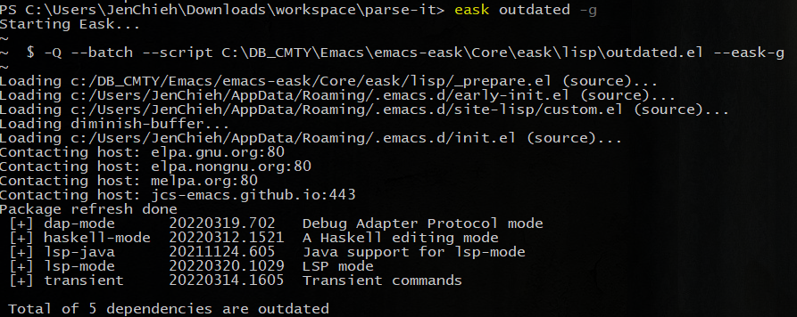

# Usage

This document explains how to use Eask, and provides a reference of its commands and options.

## Quickstart

Start by creating a file named `Eask` in the project root. Use eask init
command to create a Eask-file automatically, containing boilerplate code:

```sh
$ eask init
```

To install all dependencies:

```sh
$ eask install-deps
```

WIP

```sh
$ eask install
```

WIP

```sh
$ eask uninstall
```

WIP

```sh
$ eask package
```

WIP

```sh
$ eask outdated
```

### Clean up

WIP

```sh
$ eask clean
```

WIP

```sh
$ eask clean-elc
```

WIP

```sh
$ eask clean-all
```



### Linting

WIP

```sh
$ eask lint
```

WIP

```sh
$ eask checkdoc
```

### Options

WIP

```
--global, -g
```

WIP

```
--development, --dev
```
